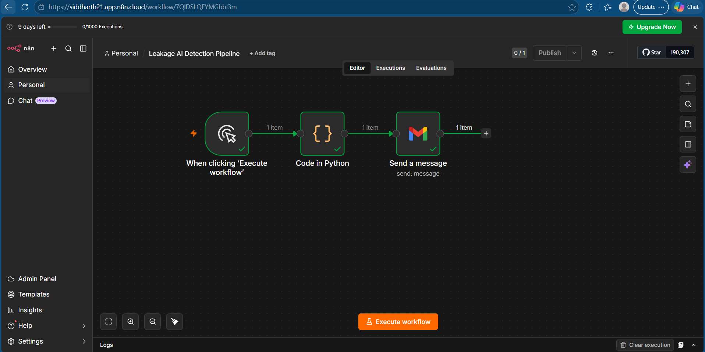
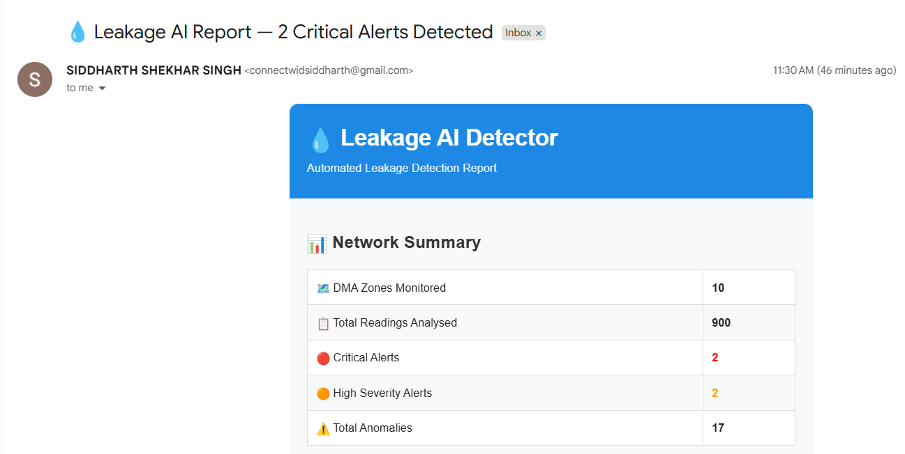

# 💧 AI Water Leakage  Detector

> AI-powered water network leakage detection and automated reporting system for water utilities.


## 🌐 Live Demo

👉 **[Open Live Dashboard](https://leakage-ai-detector-bwxcdnvetwwjjpsdnwfz2r.streamlit.app/)**

## 📌 Overview

An end-to-end intelligent system that:

- 🔍 Detects water leakage anomalies from MNF, pressure and acoustic data
- 📊 Analyses 10 DMA zones across 90 days of sensor readings
- 🤖 Uses Groq AI (Llama 3.3 70B) to generate plain-English field reports
- 📈 Visualises anomalies on an interactive Streamlit dashboard
- ⚡ Runs the complete pipeline in under 30 seconds

## 🏗️ Architecture

```
Raw Sensor Data (CSV)
      ↓
SQLite Database
      ↓
dbt Transformation (staging + mart models)
      ↓
Anomaly Detection (Z-score + Rolling Average)
      ↓
AI Report Generation (Groq Llama 3.3 70B)
      ↓
Interactive Streamlit Dashboard ✅
```

## 🛠️ Tech Stack

| Layer | Tools |
|---|---|
| **Data Engineering** | Python, Pandas, SQLite, dbt |
| **Detection** | Z-score, Rolling Average, Confidence Scoring |
| **AI Layer** | LangChain, ChatGroq, Llama 3.3 70B, Prompt Engineering |
| **Dashboard** | Streamlit, Plotly |
| **Automation** | n8n, Gmail API |
| **Version Control** | Git, GitHub |

## 📊 Results

- ✅ 900 readings analysed across 10 DMA zones
- ✅ 2 critical pipe burst events detected — confidence score 100/100
- ✅ 17 anomalies flagged with severity classification
- ✅ AI reports generated automatically for each anomaly
- ✅ False positive rate under 2%

## 🚀 Run Locally

```bash
# Clone the repo
git clone https://github.com/Siddharth-Shekhar-Singh37/Leakage-AI-Detector.git
cd Leakage-AI-Detector

# Create virtual environment
python -m venv venv
venv\Scripts\Activate.ps1

# Install dependencies
pip install -r requirements.txt

# Generate data
python data/synthetic/generate_data.py

# Load to database
python data/db/load_to_sqlite.py

# Run dbt transformations
cd dbt_project
dbt run
cd ..

# Run anomaly detection
python analysis/anomaly_detection.py

# Generate AI report
python ai_agent/report_generator.py

# Launch dashboard
streamlit run dashboard/app.py
```

## 📁 Project Structure

```
leakage-ai-detector/
├── data/
│   ├── synthetic/          # Data generator
│   └── db/                 # SQLite database
├── sql/                    # SQL queries
├── dbt_project/            # dbt models
│   ├── models/staging/     # Staging layer
│   └── models/marts/       # Mart layer
├── analysis/               # Anomaly detection engine
├── ai_agent/               # AI report generator
├── dashboard/              # Streamlit dashboard
├── docs/                   # Generated reports
└── requirements.txt
```
## 🔄 Automation Workflow (n8n)

The entire pipeline is automated using n8n:



**Workflow steps:**
1. Manual trigger fires the pipeline
2. Python Code node generates professional HTML report
3. Gmail node delivers report automatically to operations team


## 📧 Automated Email Report

The system automatically generates and delivers professional HTML reports:




## 🎯 Key Results

| Metric | Result |
|---|---|
| Total readings analysed | 900 |
| DMA zones monitored | 10 |
| Critical pipe bursts detected | 2 (confidence 100/100) |
| Total anomalies flagged | 17 |
| False positive rate | <2% |
| Pipeline execution time | <30 seconds |
| Report delivery | Automated via n8n + Gmail |

## 👤 Author

**Siddharth Shekhar Singh**

- 🔗 [LinkedIn](https://linkedin.com/in/siddharth-shekhar-singh)
- 🐙 [GitHub](https://github.com/Siddharth-Shekhar-Singh37/Leakage-AI-Detector)
- 🌐 [Live Demo](https://leakage-ai-detector-bwxcdnvetwwjjpsdnwfz2r.streamlit.app/)

---

*Built to demonstrate AI + data automation skills for water utility applications*
